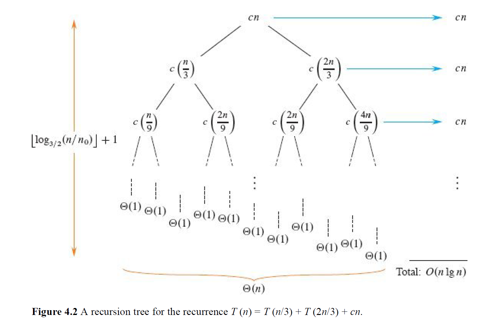

# 分治与递归

## 0.基础知识

### 0.1 Divide and Conquer

分治法（Divide and Conquer）是一种高效地算法设计策略，能够得到渐进意义上高效的算法，其核心思想就是把一个大问题分解为若干个小问题（或者说子问题），然后递归求解，把子问题的解组合起来得到原问题的解 。

分治通常包含三个步骤 ：

1. **Divide 分解：** 将原问题拆分成规模更小的子问题
2. **Conquer 解决：** 递归地解决这些子问题。如果子问题足够小到base case，则直接解决。
3. **Combine 合并：** 将子问题的解组合成原问题的解。

递归会在遇到base case的时候停下来，也即bottoms out（递归到头）。

### 0.2 递归式

#### 0.2.1 运行时间

为了分析分治算法的效率，需要建立**递归式（Recurrence）**。

递归式是一种方程或者说不等式，用函数自身在更小输入规模下的值来表示这个函数。比如，归并排序的运行时间可以写成：

$$
T(n) = 2T\!\left(\frac{n}{2}\right) + O(n)
$$

这个式子的意思是：

* 规模为n的问题的运行时间是T(n)
* 该问题会被划分为2个规模为n/2的子问题，即2T(n/2)
* 最后加上分解问题+合并结果的代价，其时间复杂度是线性时间O(n)

一个递归式可以包含两类情况：

* recursive case 递归情况：涉及函数对更小输入的递归调用，比如上面的式子。
* base case 基本情况：没有递归调用，直接给出答案。比如$T(1)=O(1)$。

一个递归式可能有零个、一个或者多个解。如果至少存在一个解，它是well defined（良定义）的；否则是ill defined（不良定义）的。

---

#### 0.2.2 算法递归式

**1. 定义**

一个描述分治算法运行时间的递归式 `T(n)`，如果对于一个足够大的阈值常数 `n₀ > 0` 满足以下两个属性，则称其为算法递归式（Algorithmic Recurrences）：

* **基本情况**
  对于所有 `n < n₀`，我们有：

$$
T(n) = \Theta(1)
$$

* **递归终止**
  对于所有 `n ≥ n₀`，每一个递归路径都必须在有限次调用内终止于一个确定的基本情况。

**2. 定义的合理性解释**

**关于属性 1 (`T(n) = \Theta(1)`)**
这代表了算法的**基本情况**。任何算法的执行都需要时间，所以运行时间必然大于一个正常数 `c₁`。对于所有小于 `n₀` 的小规模输入，其运行时间必然存在一个最大值 `c₂`。因此，当 `n < n₀` 时，运行时间 `T(n)` 满足 `0 < c₁ ≤ T(n) ≤ c₂`，这正是 `T(n) = \Theta(1)` 的定义。

**关于属性 2 (递归终止)**
这是算法**正确性**的根本要求。如果一个算法的递归过程不会在有限步内结束，它就会陷入**无限循环**，也就无法计算出解决方案。

---

#### 0.2.3 书写约定与简化

**1. 默认存在基本情况 (Implicit Base Case)**

**约定:** 当一个递归式被写出而没有明确指定其基本情况时，我们**默认它是一个“算法递归式”**。
**含义:** 这意味着我们默认存在一个足够大的阈值 `n₀`，使得当 `n < n₀` 时 `T(n) = \Theta(1)`。
**要点:** 最终求出的**渐近解** (Asymptotic Solution) 通常与 `n₀` 的具体选择无关。

**2. 忽略取整符号 (Floors and Ceilings)**

**约定:** 在处理递归式时，我们常常会**忽略向上取整 `⌈ ⌉` 和向下取整 `⌊ ⌋` 符号**。
**原因:** 省略取整符号通常不会改变递归式的渐近解，但能极大地简化数学处理过程。

**3. 处理不等式形式的递归式 (Inequalities)**

**上界 (Upper Bound):** 如果递归式只提供一个上界，例如：

$$
T(n) \le 2T\!\left(\tfrac{n}{2}\right) + \Theta(n)
$$

那么它的解也应该用上界来表示，即使用 **`O` 记号** (Big-O notation)。

**下界 (Lower Bound):** 如果递归式只提供一个下界，例如：

$$
T(n) \ge 2T\!\left(\tfrac{n}{2}\right) + \Theta(n)
$$

那么它的解也应该用下界来表示，即使用 **`Ω` 记号** (Big-Omega notation)。

---

### **0.3 分治法递归式实例**

**1. 案例：矩阵乘法 (Matrix Multiplication)**

* **普通分治算法 (Standard Divide-and-Conquer)**

**方法:** 将 `n x n` 矩阵乘法分解为 **8** 个 `n/2` 规模的子问题。
**递归式:**

$$
T(n) = 8T\!\left(\tfrac{n}{2}\right) + \Theta(1)
$$

**解:**

$$
T(n) = \Theta(n^3)
$$

* **Strassen 算法 (Strassen's Algorithm)**

**方法:** 一种更巧妙的方法，将问题分解为 **7** 个 `n/2` 规模的子问题。
**递归式:**

$$
T(n) = 7T\!\left(\tfrac{n}{2}\right) + \Theta(n^2)
$$

**解:** `T(n) = \Theta(n^{\lg 7})`，约等于 `O(n^{2.81})`。

---

**2. 子问题规模的变化 (Variations in Subproblem Size)**

* **子问题规模为不等比例**

**示例 1:**
**递归式:**

$$
T(n) = T\!\left(\tfrac{n}{3}\right) + T\!\left(\tfrac{2n}{3}\right) + \Theta(n)
$$

**解:**

$$
T(n) = \Theta(n \lg n)
$$

**示例 2:**
**递归式:**

$$
T(n) = T\!\left(\tfrac{n}{5}\right) + T\!\left(\tfrac{7n}{10}\right) + \Theta(n)
$$

**解:**

$$
T(n) = \Theta(n)
$$

* **子问题规模按常数减小**

**示例 (递归版线性搜索):**
**递归式:**

$$
T(n) = T(n - 1) + \Theta(1)
$$

**解:**

$$
T(n) = \Theta(n)
$$

**要点总结:**
绝大多数**高效的**分治算法，其子问题规模都是原问题规模的**常数分之一 (a constant fraction)**。

---

### **0.4 求解递归式的方法**

常用四种求解递归式以获得 `Θ`、`O` 或 `Ω` 渐近界的方法。

* **代入法 (Substitution Method)**

**思路:** “猜测”一个解的形式，然后用**数学归纳法**来证明这个猜测是正确的，并求解其中的常数。
**特点:** 这是最强大的方法，但需要有好的直觉做出猜测，并且后续的证明过程可能比较繁琐。

* **递归树法 (Recursion-tree Method)**

**思路:** 将递归式转换成一棵树，树的每个节点代表在某一层递归调用中的代价。通过将每一层的代价相加，最后再将所有层的代价汇总，来求得最终解。
**特点:** 是一种强大的直观工具，非常有助于“猜测”解的形式，其结果通常需要用代入法来做最后严谨的证明。

* **主方法 (The Master Method)**

**思路:** 为特定形式的递归式提供了一个“菜谱式”的解决方案，可以直接套用。
**适用形式:**

$$
T(n) = aT(n/b) + f(n)
$$

其中 `a ≥ 1` 和 `b > 1` 是常数，`f(n)` 是一个给定的函数。这个形式恰好描述了将问题分解为 `a` 个 `n/b` 规模的子问题、且分解/合并步骤代价为 `f(n)` 的分治算法。
**特点:** 是最简单的方法，只要递归式符合上述形式即可使用。需要记忆三种情况，一旦掌握，便能快速解决许多常见的分治算法递归式。

* **Akra-Bazzi 方法**

**思路:** 一种比主方法更通用的方法。
**特点:** 涉及到微积分，可以用来解决一些主方法无法处理的、更复杂的递归式。

---

## 1. 方阵乘法

### **1.1 方阵乘法问题**

方阵乘法（Multiplying Square Matrices）

**1. 问题定义**

计算两个 `n x n` 方阵的乘积 `C = A · B`。矩阵 C 中的每一个元素 `c_ij` 通过以下公式计算：

$$
c_{ij} = \sum_{k=1}^{n} a_{ik} \cdot b_{kj}
$$

**假设:** 这里的算法处理的都是**稠密矩阵 (dense matrices)**，即大部分元素都不是 0。

**2. 算法伪代码**

下面是一个直接计算方阵乘法的伪代码。该过程计算的是 `C = C + A · B`，因此如果想求 `C = A · B`，需要先将 `C` 初始化为零矩阵。

```
MATRIX-MULTIPLY(A, B, C, n)
1  for i = 1 to n
2      for j = 1 to n
3          for k = 1 to n
4              c_ij = c_ij + a_ik · b_kj
```

**3. 复杂度分析**

**循环结构:** 算法的核心是三层嵌套的 `for` 循环，每一层都精确地执行 `n` 次。

**核心操作:** 第 4 行的乘加运算 `c_ij = c_ij + a_ik · b_kj` 消耗常数时间 `Θ(1)`。

**初始化成本:** 将矩阵 `C` 初始化为零矩阵需要 `Θ(n²)` 的时间。

**总运行时间:**
三层循环的总时间成本为 `n * n * n * Θ(1)`，因此算法的运行时间为：

$$
T(n) = \Theta(n^3)
$$

`Θ(n³)` 的运行时间在渐近上**主导**了 `Θ(n²)` 的初始化成本，因此整个算法的复杂度依然是 `Θ(n³)`。

---

### 1.2 分治法方阵乘法

**1. 核心思想：分治 (Divide-and-Conquer)**

该算法将 `n x n` 的方阵乘法问题分解为更小的子问题来解决。

**假设:** 为简化分析，我们假设矩阵的维度 `n` 是 2 的整数次幂，这样在递归过程中 `n/2` 始终是整数。

**分解步骤 (Divide):**
将 `A`, `B`, `C` 三个 `n x n` 的矩阵均勻地划分为 4 个 `n/2 x n/2` 的子矩阵。

$$
A = 
\begin{pmatrix}
A_{11} & A_{12} \\
A_{21} & A_{22} 
\end{pmatrix}, \quad
B = 
\begin{pmatrix}
B_{11} & B_{12} \\
B_{21} & B_{22} 
\end{pmatrix}, \quad
C = 
\begin{pmatrix}
C_{11} & C_{12} \\
C_{21} & C_{22} 
\end{pmatrix}
$$

**解决步骤 (Conquer):**
通过子矩阵的运算来得到最终结果。这产生了 8 次 `n/2 x n/2` 规模的矩阵乘法和 4 次 `n/2 x n/2` 规模的矩阵加法。

$$
C_{11} = A_{11} \cdot B_{11} + A_{12} \cdot B_{21}
$$

$$
C_{12} = A_{11} \cdot B_{12} + A_{12} \cdot B_{22}
$$

$$
C_{21} = A_{21} \cdot B_{11} + A_{22} \cdot B_{21}
$$

$$
C_{22} = A_{21} \cdot B_{12} + A_{22} \cdot B_{22}
$$

**2. 矩阵划分的实现策略**

在代码中实现“划分”这一操作，通常有两种方法：

* **策略一：复制子矩阵 (Copying Submatrices)**

**方法:** 创建临时的 `n/2 x n/2` 矩阵，并将原始矩阵 A 和 B 的对应元素复制进去。在递归调用结束后，再将结果从临时矩阵中复制回主矩阵 C。
**代价:** 复制操作本身需要消耗时间，成本为：

$$
\Theta(n^2)
$$

* **策略二：下标计算 (Index Calculation)**

**方法:** 不实际移动任何数据。通过传递指向原始矩阵的指针以及行/列的偏移量来指定子矩阵的范围。所有对子矩阵的操作都通过下标计算直接在原始矩阵上进行。
**代价:** 这种划分操作的成本为常数时间：

$$
\Theta(1)
$$

后续的分析将假设采用**下标计算**的策略，因为它更快且更实用。

伪代码如下：

```
MATRIX-MULTIPLY-RECURSIVE(A, B, C, n)

// Base case
1  if n == 1
2      // C is a 1x1 matrix
3      c_11 = c_11 + a_11 · b_11
4      return

// Divide
5  // Partition A, B, and C into n/2 x n/2 submatrices
6  partition A into A_11, A_12, A_21, A_22;
partition B into B_11, B_12, B_21, B_22;
partition C into C_11, C_12, C_21, C_22;

// Conquer
7  // C_11 = A_11·B_11 + A_12·B_21
8  MATRIX-MULTIPLY-RECURSIVE(A_11, B_11, C_11, n/2)
9  MATRIX-MULTIPLY-RECURSIVE(A_12, B_21, C_11, n/2)

10 // C_12 = A_11·B_12 + A_12·B_22
11 MATRIX-MULTIPLY-RECURSIVE(A_11, B_12, C_12, n/2)
12 MATRIX-MULTIPLY-RECURSIVE(A_12, B_22, C_12, n/2)

13 // C_21 = A_21·B_11 + A_22·B_21
14 MATRIX-MULTIPLY-RECURSIVE(A_21, B_11, C_21, n/2)
15 MATRIX-MULTIPLY-RECURSIVE(A_22, B_21, C_21, n/2)

16 // C_22 = A_21·B_12 + A_22·B_22
17 MATRIX-MULTIPLY-RECURSIVE(A_21, B_12, C_22, n/2)
18 MATRIX-MULTIPLY-RECURSIVE(A_22, B_22, C_22, n/2)
```

### **1.3 分治法复杂度分析**

**1. 建立递归式 (Deriving the Recurrence)**

我们为 `MATRIX-MULTIPLY-RECURSIVE` 算法建立一个递归式 `T(n)` 来描述其运行时间。

**基本情况 (Base Case):**
当 `n = 1` 时，算法执行一次标量乘法和加法，耗时为 `T(1) = Θ(1)`。

**递归情况 (Recursive Case):**
当 `n > 1` 时：

* **分解 (Divide):** 矩阵划分的成本为 `Θ(1)`。
* **解决 (Conquer):** 共有 8 次对规模为 `n/2` 的子问题进行递归调用，总成本为 `8T(n/2)`。
* **合并 (Combine):** 结果是“就地”累加的，没有显式的合并步骤，成本为 0。

**递归式:**
将以上各项相加，我们得到算法运行时间的递归式（按惯例省略基本情况）：

$$
T(n) = 8T\!\left(\tfrac{n}{2}\right) + \Theta(1)
$$

**解:**
通过主方法（Master Method）可以求得该递归式的解为：

$$
T(n) = \Theta(n^3)
$$

这个结果表明，简单的分治版本与直接的三重循环版本具有相同的渐近运行时间。

**2. 与归并排序的比较 (Comparison with Merge Sort)**

**问题:**
为什么矩阵乘法的解 `Θ(n³)` 比归并排序的解 `Θ(n lg n)` 增长快得多？尽管归并排序的递归式 `T(n) = 2T(n/2) + Θ(n)` 中有一个更大的 `Θ(n)` 项。

**解释:**
关键在于**递归树的分支数量**。

* **归并排序:** 其递归树中，每个内部节点只有 **2** 个子节点。
* **矩阵乘法:** 其递归树中，每个内部节点有 **8** 个子节点。

**结论:**
虽然矩阵乘法在每个节点上的“额外”工作量 `Θ(1)` 很小，但其递归树“**茂密 (bushier)**”得多。子问题的数量以 `8` 的幂次增长，导致叶子节点的总数极为庞大。正是这种子问题数量上的爆炸式增长，主导了整体的复杂度，使其远远超过归并排序。

---

## **2. Strassen 算法**

Strassen's Algorithm for Matrix Multiplication

**1. 核心思想与动机**

Strassen 算法是第一个已知的、时间复杂度在渐近意义上优于 `Θ(n³)` 的矩阵乘法算法。

**核心策略:**
通过增加矩阵加减法的次数，来**减少**递归中矩阵乘法的次数。这个策略的灵感来源于代数技巧，例如用 `(x+y)(x-y)` （1次乘法，2次加减）来代替 `x² - y²` （2次乘法，1次减法）。对于大矩阵而言，乘法的成本远高于加法，因此这种交换是划算的。

**目标:**
将简单分治算法中递归树的**分支数量从 8 减少到 7**。这种“茂密度”的微小降低，带来了显著的渐近性能提升。

**2. Strassen 算法的四个步骤**

该算法将分治思想巧妙地应用于矩阵乘法。

* **第一步：分解 (Divide)**

**方法:** 将输入的 `n x n` 矩阵 `A`, `B` 和输出矩阵 `C` 分解为 `n/2 x n/2` 的子矩阵。
**代价:** 采用下标计算，成本为 `Θ(1)`。

* **第二步：创建线性组合 (Create Linear Combinations)**

**方法:** 创建 10 个 `n/2 x n/2` 的临时矩阵 `S₁`, `S₂`, ..., `S₁₀`。每个 `S` 矩阵都是第一步中产生的子矩阵的和或差。

$$
\begin{aligned}
S_1 &= B_{12} - B_{22} \\
S_2 &= A_{11} + A_{12} \\
S_3 &= A_{21} + A_{22} \\
S_4 &= B_{21} - B_{11} \\
S_5 &= A_{11} + A_{22} \\
S_6 &= B_{11} + B_{22} \\
S_7 &= A_{12} - A_{22} \\
S_8 &= B_{21} + B_{22} \\
S_9 &= A_{11} - A_{21} \\
S_{10} &= B_{11} + B_{12}
\end{aligned}
$$

**代价:** 这一步包含 10 次 `n/2 x n/2` 矩阵的加减法，总成本为 `Θ(n²)`。

* **第三步：递归计算 (Recursive Computation)**

**方法:** **递归地**计算 7 个 `n/2 x n/2` 矩阵的乘积 `P₁`, `P₂`, ..., `P₇`。这是算法的核心，也是其性能优势的来源。

$$
\begin{aligned}
P_1 &= A_{11} \cdot S_1 \\
P_2 &= S_2 \cdot B_{22} \\
P_3 &= S_3 \cdot B_{11} \\
P_4 &= A_{22} \cdot S_4 \\
P_5 &= S_5 \cdot S_6 \\
P_6 &= S_7 \cdot S_8 \\
P_7 &= S_9 \cdot S_{10}
\end{aligned}
$$

**代价:** 7 次对 `n/2` 规模子问题的递归调用，成本为 `7T(n/2)`。

* **第四步：合并结果 (Combine)**

**方法:** 通过对 `P` 矩阵进行不同的加减组合，计算出输出矩阵 `C` 的四个子矩阵 `C₁₁`, `C₁₂`, `C₂₁`, `C₂₂`。

$$
\begin{aligned}
C_{11} &= P_5 + P_4 - P_2 + P_6 \\
C_{12} &= P_1 + P_2 \\
C_{21} &= P_3 + P_4 \\
C_{22} &= P_5 + P_1 - P_3 - P_7
\end{aligned}
$$

**代价:** 这一步包含 8 次 `n/2 x n/2` 矩阵的加减法，总成本为 `Θ(n²)`。

**3. 复杂度分析**

**递归式:**
综合以上四个步骤的成本，我们得到 Strassen 算法的运行时间递归式：

$$
T(n) = 7T\!\left(\tfrac{n}{2}\right) + \Theta(n^2)
$$

**解:**
该递归式的解为：

$$
T(n) = \Theta(n^{\lg 7}) \approx O(n^{2.81})
$$

**结论:**
由于 `log₂7 ≈ 2.81`，Strassen 算法的渐近运行时间优于 `Θ(n³)` 的传统方法和简单分治方法。它用 18 次 `Θ(n²)` 的加减法操作换取了一次 `T(n/2)` 的递归乘法，最终获得了性能上的胜利。

---

## 3. 代入法

### **3.1 代入法**

代入法(The Substitution Method) 是求解递归式的一种通用方法，其过程分为两步。

**1. 核心步骤**

**第一步：猜测 (Guess)**
猜测解的渐近形式（例如 `O(n lg n)`）。

**第二步：证明 (Prove)**
使用**数学归纳法**来证明这个猜测是正确的，并在这个过程中找出满足条件的常数。

**策略:**
通常最好不要直接证明 `Θ` 界。更稳妥的方法是先证明 `O` 上界，再单独证明 `Ω` 下界。

**2. 示例：求解 T(n) = 2T(⌊n/2⌋) + Θ(n)**

* **第一步：猜测解**

我们猜测该递归式的解为 `T(n) = O(n lg n)`。

**归纳假设 (Inductive Hypothesis):**
我们必须更精确地证明 `T(n) ≤ c n lg n` 对于某些常数 `c > 0` 和所有 `n ≥ n₀` 成立。

* **第二步：归纳证明**

**归纳步骤 (Inductive Step):**
我们假设这个结论对于所有小于 `n` 的值成立，特别是对于 `⌊n/2⌋`：

$$
T(\lfloor n/2 \rfloor) \le c \lfloor n/2 \rfloor \lg(\lfloor n/2 \rfloor)
$$

现在，我们将这个假设**代入**原递归式中：

$$
\begin{aligned}
T(n) &\le 2 \left( c \lfloor n/2 \rfloor \lg(\lfloor n/2 \rfloor) \right) + \Theta(n) \\
&\le 2 \left( c (n/2) \lg(n/2) \right) + \Theta(n) \\
&= c n \lg(n/2) + \Theta(n) \\
&= c n (\lg n - \lg 2) + \Theta(n) \\
&= c n \lg n - c n + \Theta(n)
\end{aligned}
$$

为了完成证明，我们必须证明上式小于等于我们期望的结果 `c n lg n`：

$$
c n \lg n - c n + \Theta(n) \le c n \lg n
$$

只要我们选择一个足够大的常数 `c`，使得 `c n` 能够“压制”住 `Θ(n)` 项（例如 `cn ≥ 2 * d*n`，如果 `Θ(n) <= d*n`），这个不等式就能成立。

**基本情况 (Base Cases):**
归纳法还需要一个起点。我们需要证明对于一个或多个初始值 `n₀`，归纳假设也成立。对于算法递归式，当 `n` 很小时 `T(n)` 是常数。我们可以选择 `n₀=2`。`T(2)` 和 `T(3)` 都是常数。我们只需选择一个足够大的 `c`，使得 `T(2) ≤ c * 2 lg 2` 和 `T(3) ≤ c * 3 lg 3` 成立即可。对于任何常数值的 `T(2)` 和 `T(3)`，我们总能找到这样的 `c`。

因此，我们证明了 `T(n) = O(n lg n)`。

---

### **3.2 如何做出好的猜测**

为代入法找到一个正确的猜测并没有通用的方法，这更像是一门艺术，需要**经验**、**直觉**，有时还需要一点**创造力** 🤔。不过，有几种策略可以帮你成为一个更好的猜测者(Making a Good Guess)。

**提升猜测能力的策略 (Strategies to Improve Guessing)：**

* **类比已知问题 (Analogize to Known Problems)** 🧐

  **思路:** 如果一个新递归式看起来很像你已经知道解的另一个递归式，那么它们的解也很可能相似。

  **例子:** 考虑递归式：

  $$
  (n) = 2T(n/2 + 17) + \Theta(n)
  $$

  这个式子和归并排序的 `T(n) = 2T(n/2) + Θ(n)` 很像。直观上，当 `n` 很大时，`n/2` 和 `n/2 + 17` 的差别不大，那个 `+17` 应该不会影响最终的渐近解。因此，一个非常合理的猜测就是 `O(n lg n)`。
* **设置界限并收紧 (Set Bounds and Tighten Them)** 🎯

  **思路:** 先确定一个**宽松的上界**和一个**宽松的下界**，然后逐步收紧这两个界，直到它们收敛为一个紧确界。

  **例子:** 对于 `T(n) = 2T(⌊n/2⌋) + Θ(n)`:

  * **宽松下界:** 因为式子中包含 `Θ(n)` 项，所以解**至少是** `Ω(n)`。
  * **宽松上界:** 我们可以先随便猜一个比较宽松的上界，比如 `O(n²)`。
  * **收紧过程:** 现在我们知道解在 `Ω(n)` 和 `O(n²)` 之间。接下来可以尝试证明一个更紧的上界，比如 `O(n lg n)`。如果成功，我们就找到了紧确界 `Θ(n lg n)`。
* **使用递归树 (Use Recursion Trees)** 🌳

  **思路:** 递归树是一种强大的可视化工具，可以帮助我们观察成本在递归的每一层如何分布，从而得出一个非常靠谱的猜测。 (这将在下一节详细介绍)。

---

### **3.3 代入法技巧**

代入法技巧：减去一个低阶项 (A Trick of the Trade: Subtracting a Low-Order Term)。

有时候，即使你对解的渐近界做出了**正确的猜测**，但在进行数学归纳证明时，代数运算却无法顺利完成。这通常意味着你的**归纳假设不够强**。

**问题：当归纳证明失败时 (The Problem: When the Inductive Proof Fails) 🤔**

让我们来看一个典型的例子。

**递归式:**

$$
T(n) = 2T(n/2) + \Theta(1)
$$

**猜测:**
一个很自然的猜测是 `T(n) = O(n)`。

**失败的证明尝试:**
我们设置**归纳假设**为 `T(n) ≤ cn`。将其代入递归式：

$$
\begin{aligned}
T(n) &\le 2(c(n/2)) + \Theta(1) \\
&= cn + \Theta(1)
\end{aligned}
$$

我们的目标是证明 `T(n) ≤ cn`，但我们得到的结果是 `cn + Θ(1)`。因为 `Θ(1)` 是一个正的常数，`cn + Θ(1) ≤ cn` **永远无法成立**。因此，证明失败了。

**解决方法：强化归纳假设 (The Solution: Strengthen the Inductive Hypothesis) 💡**

**技巧:**
当上述情况发生时，解决方法通常是**强化你的归纳假设**，具体做法是从你的猜测中**减去一个低阶项**。

**新的归纳假设:**
我们修改假设为 `T(n) ≤ cn - d`，其中 `d ≥ 0` 是一个我们稍后选择的常数。

**成功的证明:**
将新的假设代入递归式：

$$
\begin{aligned}
T(n) &\le 2(c(n/2) - d) + \Theta(1) \\
&= cn - 2d + \Theta(1)
\end{aligned}
$$

现在，我们的目标是证明 `cn - 2d + \Theta(1) ≤ cn - d`。这个不等式成立的条件是：

$$
-2d + \Theta(1) \le -d \quad \iff \quad \Theta(1) \le d
$$

我们总可以**选择一个足够大的常数 `d`** 来满足 `d ≥ Θ(1)` 这个条件。因此，归纳步骤成立了。（当然，我们还需要通过选择一个足够大的 `c` 来处理好基本情况）。

**为什么减法有效？(Why Does Subtracting Work?)**

这看起来可能有些反直觉。如果证明差了一点，难道不应该把猜测变大（加上一项）吗？

**关键在于递归系数：**
这里的关键是，我们猜测中的低阶项 `-d` 在代入时被递归系数（这里是 **2**）**放大了**。

* 当我们代入 `cn - d` 时，它变成了 `cn - 2d`。
* 这个 `-2d` 可以分解为 `-d - d`。其中一个 `-d` 用来满足我们最终的目标 `cn - d`，而另一个“多出来”的 `-d` 则可以用来**抵消**掉那个最初导致证明失败的 `+Θ(1)` 项。

如果我们错误地加上一项（猜测 `cn + d`），代入后会得到 `cn + 2d + Θ(1)`，这会使我们离目标 `cn + d` 更远。

---

#### 3.4 代入法的常见陷阱 (Avoiding Pitfalls in the Substitution Method)

使用代入法时，你必须非常小心地处理常数和归纳假设，否则很容易陷入逻辑谬误，得出错误的“证明”。

**陷阱一：在归纳假设中使用渐近记号 (Pitfall 1: Using Asymptotic Notation in the Hypothesis) 🚫**

**错误做法:**
千万不要将你的归纳假设直接写成渐近形式，比如 `T(n) = O(n)`。

**为什么错误:**
`O` 记号**隐藏了具体的常数** `c`。在归纳证明的推导过程中，每一步 `O` 记号背后的常数可能都不同。例如，你可能会推导出 `T(n) ≤ cn + Θ(n)`。虽然 `cn + Θ(n)` 确实等于 `O(n)`，但你无法从这里得出 `cn + Θ(n) ≤ cn` 的结论，因为前者隐藏的常数肯定比 `c` 要大。这使得证明无法进行下去。

**正确做法:**
**一定要使用明确的常数**来陈述你的归纳假设。你应该写成 `T(n) ≤ cn` 或者 `T(n) ≤ cn - d` 这样的具体形式。

**陷阱二：没有证明确切的归纳假设 (Pitfall 2: Not Proving the Exact Hypothesis) 🎯**

**错误做法:**
在证明过程的最后一步，将一个具体的不等式（如 `cn + Θ(n)`）直接归结为渐近记号（如 `O(n)`）来“完成”证明。

**例子中的错误流程:**
假设你的归纳假设是 `T(n) ≤ cn`。

$$
\begin{aligned}
T(n) &\le 2(c \lfloor n/2 \rfloor) + \Theta(n) \\
&\le cn + \Theta(n) \\
&= O(n)  \qquad \Longleftarrow \text{这是一个错误的结论步骤!}
\end{aligned}
$$

**为什么错误:**
数学归纳法要求你**严格证明你的假设本身**。你的目标是证明 `T(n) ≤ cn`，而不是证明 `T(n)` 属于 `O(n)` 这个集合。在推导出 `cn + Θ(n)` 之后，你必须通过代数方法证明 `cn + Θ(n) ≤ cn`（或者 `≤ cn-d` 等你的确切假设形式）。简单地将其标记为 `O(n)` 只是重复了你的猜测，并没有完成证明。

**正确做法:**
归纳证明的最后一步**必须**推导出与你的假设完全相同的形式。例如，最终你必须得到 `... ≤ cn` 或 `... ≤ cn - d`。

---

## **4.递归树法 (The Recursion-Tree Method)**

递归树法是一种强大的直观工具，主要用于**为代入法生成一个好的猜测** 💡。

**核心思想 (Core Idea) 🌳**

递归树将一个递归式**可视化**。在树中，每个节点代表递归调用中产生的单个子问题的成本。

**求解过程:**

1. **展开树结构：** 将递归式展开成一棵树，直到叶子节点。
2. **计算每层成本：** 将树的每一层的所有节点的成本相加，得到该层的总成本。
3. **累加所有层：** 将所有层的成本（包括叶子节点）全部加起来，得到整个递归式的总成本。

---

### **4.1 示例：求解 T(n) = 3T(n/4) + cn²**

**1. 用递归树法得出猜测 (Making a Guess with the Recursion Tree)**

**树的结构分析:**

* **第 0 层 (根节点):** 成本是 `cn²`。
* **第 1 层:** 有 **3** 个子节点，该层总成本为 `3 * c(n/4)² = (3/16)cn²`。
* **第 i 层 (一般情况):** 有 `3^i` 个节点，该层总成本为 `(3/16)^i * cn²`。
* **树的高度:** 树高 `h = log₄n`。
* **叶子节点:** 共有 `n^(log₄3)` 个叶子，叶子层的总成本为 `Θ(n^(log₄3))`。


**计算总代价:**
我们将所有层的成本加起来，得到一个几何级数：

$$
T(n) = \sum_{i=0}^{\log_4n-1} \left(\frac{3}{16}\right)^i cn^2 + \Theta(n^{\log_43})
$$

我们可以用一个无限递减几何级数的和来为这个求和提供一个上界：

$$
\begin{aligned}
T(n) &< \left(\sum_{i=0}^{\infty} \left(\frac{3}{16}\right)^i \right) cn^2 + \Theta(n^{\log_43}) \\
&= \frac{1}{1 - 3/16} cn^2 + \Theta(n^{\log_43}) \\
&= \frac{16}{13} cn^2 + \Theta(n^{\log_43})
\end{aligned}
$$

因为 `log₄3 ≈ 0.79`，所以 `n^(log₄3)` 是一个比 `n²` 低阶的项。

**得出猜测:**
树的总成本由根节点的成本 `cn²` 主导。因此，我们得出一个合理的猜测：`T(n) = O(n²)`。

---

**2. 用代入法验证猜测 (Verifying the Guess with the Substitution Method) ✅**

现在，我们用**代入法**来严格证明我们从递归树得到的猜测 `T(n) = O(n²)` 是正确的。

**这个界是紧确的吗？**
是的。因为原递归式 `T(n) = 3T(n/4) + Θ(n²)` 中包含 `Θ(n²)` 这一项，所以解的下界必然是 `Ω(n²)`。如果一个解既是 `O(n²)` 又是 `Ω(n²)`，那么它就是 `Θ(n²)`。

**归纳证明:**
我们要证明 `T(n) = O(n²)`。

**归纳假设:** `T(n) ≤ dn²`，对于某个我们待选择的常数 `d > 0` 成立。（这里用 `d` 是为了和递归式中已有的 `c` 区分开）。

**归纳步骤:**
将假设代入递归式 `T(n) ≤ 3T(n/4) + cn²`：

$$
\begin{aligned}
T(n) &\le 3(d(n/4)^2) + cn^2 \\
&= 3d\frac{n^2}{16} + cn^2 \\
&= \frac{3}{16}dn^2 + cn^2 \\
&= \left(\frac{3}{16}d + c\right) n^2
\end{aligned}
$$

我们的目标是证明上式 `≤ dn²`。这个条件成立，当且仅当：

$$
\frac{3}{16}d + c \le d
$$

解这个关于 `d` 的不等式：

$$
\begin{aligned}
c &\le d - \frac{3}{16}d \\
c &\le \frac{13}{16}d \\
d &\ge \frac{16}{13}c
\end{aligned}
$$

**结论:**
因为 `c` 是递归式给定的一个常数，我们**完全可以自由选择**一个常数 `d` 只要它满足 `d ≥ (16/13)c`。同时我们也可以选择一个足够大的 `d` 来覆盖基本情况。因此，归纳假设成立。

我们成功地证明了 `T(n) = O(n²)`。

---

### 4.2 不规则例子

让我们来分析一个更复杂的、**不平衡**的递归式(An Irregular Example)。

**递归式:**

$$
T(n) = T(n/3) + T(2n/3) + \Theta(n)
$$

由于 `1/3 + 2/3 = 1`，这个递归式看起来很特别。它的递归树左右子树的深度不同，不是一棵“完美”的树。



---

**1. 分析内部节点成本 (Analyzing Internal Node Cost) 💻**

**树的高度 (Height):**
树的高度由**最长的路径**决定，也就是每次都选择较大子问题（`2n/3`）的路径。这条最右侧路径的长度 `h` 满足 `(2/3)^h * n ≈ 1`，解得 `h = log_{3/2}n`。因此，树的高度是 `Θ(lg n)`。

**每层成本 (Cost Per Level):**
一个有趣的现象是，这棵树的**每一层的成本之和都是 `cn`**。

* 第 0 层: `cn`
* 第 1 层: `c(n/3) + c(2n/3) = cn`
* 第 2 层: `c(n/9) + c(2n/9) + c(2n/9) + c(4n/9) = cn`
* ...以此类推，直到最深的叶子出现前，每层成本都恰好是 `cn`。

**内部节点总成本 (Total Internal Cost):**
我们将每层的成本 `cn` 乘以树的高度 `Θ(lg n)`，可以得出一个简单的上界：

$$
\text{内部节点总成本} = O(n \lg n)
$$

**2. 分析叶子节点成本 (Analyzing Leaf Node Cost) 🌿**

现在，我们需要计算所有叶子节点的总成本，这需要我们先知道叶子的数量。

**叶子数量的递归式 (Recurrence for Number of Leaves):**
我们可以为叶子的数量 `L(n)` 建立一个新的、更简单的递归式。当问题足够小时，它就是一个叶子（成本为1）。否则，叶子的总数就是其左右子树的叶子数之和。

$$
L(n) = L(n/3) + L(2n/3) \quad (\text{当 } n \text{ 足够小时，} L(n)=1)
$$

**求解 L(n):**
使用代入法，我们可以很容易地证明 `L(n) = O(n)`。（假设 `L(k) ≤ dk`，则 `L(n) ≤ d(n/3) + d(2n/3) = dn`）。

**叶子节点总成本 (Total Leaf Cost):**
叶子节点的总成本是叶子数量乘以每个叶子的成本（`Θ(1)`）。

$$
\text{叶子节点总成本} = O(n) \cdot \Theta(1) = O(n)
$$

---

**3. 得出最终猜测 (Reaching the Final Guess) ✨**

**总成本 (Total Cost):**
将内部节点和叶子节点的成本相加：

$$
\begin{aligned}
T(n) &= (\text{内部节点成本}) + (\text{叶子节点成本}) \\
&= O(n \lg n) + O(n)
\end{aligned}
$$

`O(n lg n)` 这一项是主导项。

**最终猜测:**

$$
T(n) = \Theta(n \lg n)
$$

**重要提示:** 递归树法得出的猜测非常可靠，但为了保证数学上的严谨性，最后总应该用**代入法**来正式验证它。

---

## 5. Master Theory
