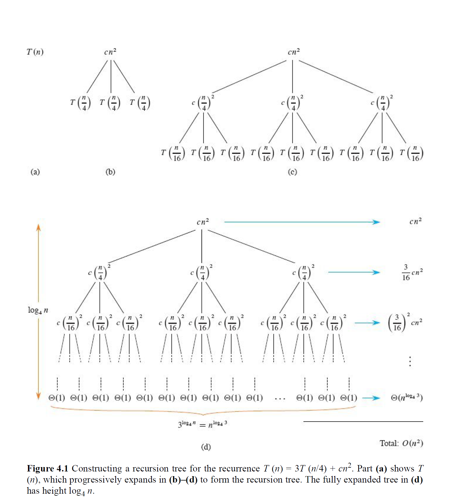
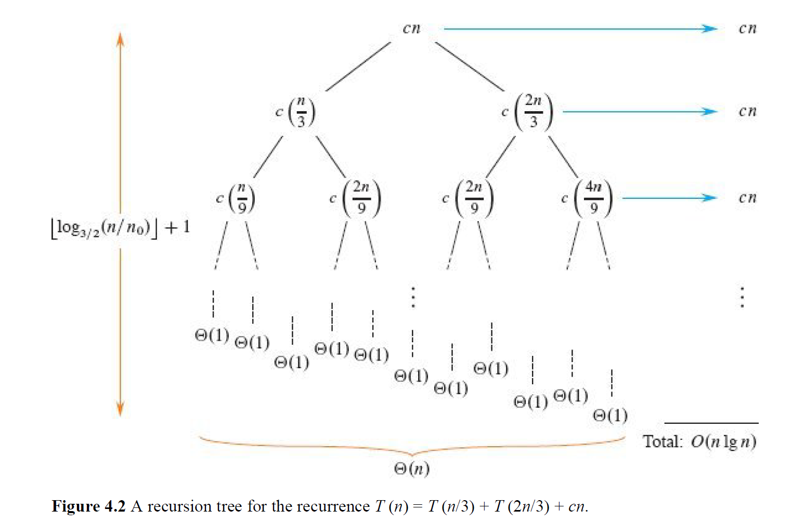

# 算法递归式

## 1. 算法递归式

### 1.1 分治思想

分治法（Divide and Conquer）是一种高效地算法设计策略，能够得到渐进意义上高效的算法，其核心思想就是把一个大问题分解为若干个小问题（或者说子问题），然后递归求解，把子问题的解组合起来得到原问题的解 。

分治通常包含三个步骤 ：

1. **Divide 分解：** 将原问题拆分成规模更小的子问题
2. **Conquer 解决：** 递归地解决这些子问题。如果子问题足够小到base case，则直接解决。
3. **Combine 合并：** 将子问题的解组合成原问题的解。

递归会在遇到base case的时候停下来，也即bottoms out（递归到头）。

---

### 1.2 算法递归式

递归式本身是一个数学概念，在数学领域（特别是离散数学中）用来定义一个数字序列。他的典型特征就是：序列中的每一项都是由它前面的一项或几项来决定的。最经典的例子就是斐波那契数列了：

$$
F(n) = F(n-1) + F(n-2)
$$

$$
\text{base case: } F(0) = 0,\; F(1) = 1
$$

在算法领域中，对于普通算法，我们直接考虑算法本身的循环就能得到运行次数；但是对于递归算法，或者说分治、归并等，我们会发现代码会调用自身，从而让分析代码运行效率变得艰难。比如说，归并排序的运行时间式这么写的：

$$
T(n) = 2T\!\left(\tfrac{n}{2}\right) + O(n)
$$

就是。

这就是**递归式（Recurrence）**或者说**算法递归式（Algorithmic Recurrences）**。这个式子的意思是：

* 规模为n的问题的运行时间是T(n)
* 该问题会被划分为2个规模为n/2的子问题，即2T(n/2)
* 最后加上分解问题+合并结果的代价，其时间复杂度是线性时间O(n)

**一个标准的算法递归式由两部分组成：**

* **Base Case 基本情况：** 对于足够小的问题规模$n$（一般来说，小于某个阈值$n_0$），其解决问题的时间是一个常数，也即：

$$
T(n) = \Theta(1) \quad \text{for } n < n_{0}
$$

* **Recursive Step 递归步骤：** 对于较大的问题规模$n$，其运行时间由分解出的子问题的运行时间和分解/合并步骤自身的时间共同定义：

$$
T(n) = (\text{子问题的成本}) + (\text{分解与合并的成本})
$$

**一个算法递归式必须满足以下基本属性：**

* 必须有基本情况，且这个基本情况在常数范围内。
* 递归必须在有限步内终止，这是算法正确性（Correctnness）的基本要求。

一个递归式可能有零个、一个或者多个解。如果至少存在一个解，它是well defined（良定义）的；否则是ill defined（不良定义）的。

很显然，如果我们想了解这个递归式的具体时间复杂度，我们就必须借助一些额外的工具来完成。一般我们会使用归纳法（Induction）或者主方法（Master Method）等，在后面的部分中我们会详细讲解各个方法的适用情况和使用方式。

---

### 1.3 例：矩阵乘法

我们来看一个例子，来了解算法递归式是如何清晰地记录算法在解决问题上的策略和其效率的。

比如说，我们的目标是计算矩阵A和矩阵B的乘法，来得到C：

矩阵 A：

$$
A = \begin{pmatrix}
1 & 2 & 3 & 4 \\
5 & 6 & 7 & 8 \\
9 & 1 & 2 & 3 \\
4 & 5 & 6 & 7
\end{pmatrix}
$$

矩阵 B：

$$
B = \begin{pmatrix}
8 & 7 & 6 & 5 \\
4 & 3 & 2 & 1 \\
1 & 2 & 3 & 4 \\
5 & 6 & 7 & 8
\end{pmatrix}
$$

计算两个 `n x n` 方阵的乘积 `C = A · B`。矩阵 C 中的每一个元素 `c_ij` 通过以下公式计算：

$$
c_{ij} = \sum_{k=1}^{n} a_{ik} \cdot b_{kj}
$$

**假设:** 这里的算法处理的都是**稠密矩阵 (dense matrices)**，即大部分元素都不是 0。

如果我们用最直观的直接乘法，即用三层for循环来实现的话，我们的时间复杂度是$\Theta(n^3$)。

```
MATRIX-MULTIPLY(A, B, C, n)
1  for i = 1 to n
2      for j = 1 to n
3          for k = 1 to n
4              c_ij = c_ij + a_ik · b_kj
```

但是如果我们用分治的思路，把大矩阵分解为小矩阵，则可以用递归的方式来求解：

1. 分解（Divide）：将 4x4 的 A 和 B 矩阵，都分解成 4 个 2x2 的子矩阵。
2. 解决（Conquer）：对这些 2x2 的子矩阵进行乘法和加法运算，以计算出结果 C 的 4 个 2x2 子矩阵。
3. 合并（Combine）：将计算出的 4 个 2x2 子矩阵拼接成最终的 4x4 结果矩阵 C。

分解如下：

$$
A = \begin{pmatrix}
A_{11} & A_{12} \\
A_{21} & A_{22}
\end{pmatrix},
\quad
B = \begin{pmatrix}
B_{11} & B_{12} \\
B_{21} & B_{22}
\end{pmatrix}
$$

$$
其中，\;
A_{11} = \begin{pmatrix}
1 & 2 \\
5 & 6
\end{pmatrix}, \quad
B_{11} = \begin{pmatrix}
8 & 7 \\
4 & 3
\end{pmatrix}，\;\text{以此类推。}
$$

然后解决：

$$
\begin{aligned}
C_{11} &= A_{11}B_{11} + A_{12}B_{21} \\
C_{12} &= A_{11}B_{12} + A_{12}B_{22} \\
C_{21} &= A_{21}B_{11} + A_{22}B_{21} \\
C_{22} &= A_{21}B_{12} + A_{22}B_{22}
\end{aligned}
$$

请注意，这里需要进行 **8 次** 2x2 矩阵的乘法（递归调用）和 4 次 2x2 矩阵的加法。

综上，我们可以得到算法递归式：

$$
T(n) = 8T\!\left(\tfrac{n}{2}\right) + \Theta(n^2)
$$

* `8T(n/2)`: 代表 8 次规模为一半的子问题（矩阵乘法）的成本。
* `Θ(n²)`: 代表 4 次子矩阵加法的成本（两个 n/2 x n/2 矩阵相加需要 n²/4 次标量加法）。

这个方法可以使用主方法分析（后面会讲到），得到其算法的效率为$\Theta(n^3)$，即没有带来渐进意义上的效率提升。在这个问题中，分治法的瓶颈在于8次递归调用。

如果我们用更少的递归调用次数来完成任务，那么我们就可以在渐进意义上获得效率提升。**Strassen算法**就是用来解决这个问题的，它通过巧妙的代数运算，将递归次数从8次减少到了7次，从而实现了更高的效率。

由于Strassen算法实现不是这里的重点，因此具体的方法就不展开描述了。本部分的核心与重点在于了解递归式。接下来我们来看一下，如何用一些工具和技巧，由递归式出发，快速了解一个算法递归式的实际效率。

---

## 2. Substitution Method

### 2.1 代入法

代入法（Substitution Method）是一个用来严格证明递归式解的数学工具。它包含两个核心步骤：

1. Guess，即提出假说：观察一个递归式，根据经验或者别的工具，猜测一个它可能的时间复杂度，比如$O(nlogn)$。
2. Prove, 即进行验证：使用数学归纳法（最严谨的数学工具）来证明这个假说在数学上是站得住脚的。

代入法的好处在于，无论递归式长什么样子，只要你能猜对，那么原则上都可以用它来证明。

代入法的难点在于猜测，一个好的猜测可以让我们事半功倍。一般猜测策略主要有三种：

* **类比法** ：看看这个递归式和你已经知道解的某个经典递归式（比如归并排序）像不像。如果很像，它们的解也很可能是一样的。
* **递归树法 (最常用)** ：画出递归树，观察每一层成本的分布和树的总层数，通常能得出一个非常精准的猜测。
* **上下界法** ：先确定一个宽松的下界（比如 `Ω(n)`）和一个宽松的上界（比如 `O(n²)`），然后逐步向中间“挤压”，缩小范围。

---

猜测后，我们就用数学归纳法进行证明（这是代入法操作的核心）。假设你已经猜出解是 $O(n \log n)$：

**1. 明确证明目标：**

- 将你的猜测 $O(n \log n)$ 翻译成一个包含具体常数 $c$ 的不等式。
- **目标**：证明存在常数 $c > 0$ 和 $n_0$，使得对于所有 $n \geq n_0$，都有 $T(n) \leq c n \log n$ 成立。
- **关键！** 绝不能在假设里使用 $O$ 符号，否则无法进行证明。

**2. 写出归纳假设：**

- 假设对于所有小于 $n$ 的值 $k$，目标不等式都成立。
  即：
  $$
  T(k) \leq c k \log k
  $$

**3. 代入并推导：**

- 将递归式中的 $T(\dots)$ 项用你的归纳假设替换掉。

例如，对于 $T(n) = 2T(n/2) + n$：

$$
\begin{aligned}
T(n) &= 2T(n/2) + n \\[6pt]
     &\leq 2\bigl(c(n/2)\log(n/2)\bigr) + n \quad (\text{进行代入}) \\[6pt]
     &= cn(\log n - \log 2) + n \\[6pt]
     &= cn \log n - cn + n
\end{aligned}
$$

**4. 验证结论：**

- 检查推导结果是否 **小于等于** 你的目标 $c n \log n$。

即：

$$
cn \log n - cn + n \;\leq\; cn \log n
$$

化简得：

$$
-cn + n \leq 0 \quad \Leftrightarrow \quad n \leq c n \quad \Rightarrow \quad c \geq 1
$$

这告诉我们：只要常数 $c \geq 1$，归纳证明就能成功。

**5. 处理基本情况 (Base Case)：**

- 最后，确保你的不等式在一些小的初始值 (比如 $n=2,3$) 上也成立。
- 通常，只要把常数 $c$ 选得足够大，总能满足基本情况。

---

既然该方法起始于猜测，那么自然就有猜错的时候，也即证明失败的时候。比如说，对于 `T(n) = 2T(n/2) + 1`，猜测 `T(n) = O(n)`：

* 设置目标 `T(n) ≤ cn`。
* 代入后得到 `T(n) ≤ cn + 1`。
* 你永远无法证明 `cn + 1 ≤ cn`。证明失败。

这个失败通常意味着你的假设“不够强”，无法在递归中传递下去。这个时候我们可以从猜测中 **减去一个低阶项**，然后我们的目标就变成了证明 `T(n) ≤ cn - d`，其中 `d` 是一个待定的正常数。那么这个为什么有效呢？

$$
\begin{aligned}
T(n) &= 2T(n/2) + 1 \\[6pt]
     &\leq 2\bigl(c(n/2) - d\bigr) + 1 \quad \text{（代入新假设）} \\[6pt]
     &= cn - 2d + 1
\end{aligned}
$$

即，新验证要求我们证明 `cn - 2d + 1 ≤ cn - d`，这等价于 `-2d + 1 ≤ -d`，即 `1 ≤ d`。只要我们选择一个常数 `d ≥ 1`（比如 `d=1`），证明就成功了！**其原理在于** ：我们减去的 `-d` 在递归代入时，被递归系数 `a=2` **放大**成了 `-2d`。这个被放大的“负能量”足以抵消掉那个导致我们证明失败的 `+1`。

---

### 2.2 例题

**a.**

$$
T(n) = T(n-1) + n \quad \Rightarrow \quad T(n) = O(n^2)
$$

**1. 明确目标：**
我们要证明 $T(n) = O(n^2)$。
根据定义，我们需要找到常数 $c > 0$ 和 $n_0$，使得对于所有 $n \geq n_0$，都有

$$
T(n) \leq c n^2
$$

成立。

**2. 归纳假设：**
假设对于所有小于 $n$ 的值 $k$，结论都成立。即：

$$
T(k) \leq c k^2
$$

特别地，对于 $k = n-1$：

$$
T(n-1) \leq c(n-1)^2
$$

**3. 代入并推导：**
将归纳假设代入原递归式：

$$
\begin{aligned}
T(n) &= T(n-1) + n \\[6pt]
     &\leq c(n-1)^2 + n \\[6pt]
     &= c(n^2 - 2n + 1) + n \\[6pt]
     &= c n^2 - 2cn + c + n
\end{aligned}
$$

**4. 验证结论：**
我们的目标是证明上式 $\leq c n^2$：

$$
c n^2 - 2cn + c + n \;\leq\; c n^2
$$

化简得：

$$
-2cn + c + n \leq 0 \quad \Longleftrightarrow \quad n(1 - 2c) + c \leq 0
$$

为了让这个不等式对足够大的 $n$ 恒成立，$n$ 的系数 $(1-2c)$ 必须为负。

- $1 - 2c < 0 \;\;\Longleftrightarrow\;\; c > 1/2$

因此，只要我们选择 $c > 1/2$（例如 $c=1$），当 $n$ 足够大时，这个式子就恒成立。

**5. 结论：**
我们成功找到了满足条件的常数（例如 $c=1$），因此证明了：

$$
T(n) = O(n^2)
$$

---

**b.**

$$
T(n) = T(n/2) + \Theta(1) \quad \Rightarrow \quad T(n) = O(\lg n)
$$


**1. 明确目标：**
我们将 $\Theta(1)$ 写为常数 $d$。目标是证明存在常数 $c > 0$ 和 $n_0$，使得对于 $n \geq n_0$，都有

$$
T(n) \leq c \lg n.
$$

**2. 归纳假设：**
假设对于所有 $k < n$，都有

$$
T(k) \leq c \lg k.
$$

**3. 代入推导：**

$$
\begin{aligned}
T(n) &= T(n/2) + d \\[6pt]
     &\leq c \lg (n/2) + d \\[6pt]
     &= c(\lg n - 1) + d \\[6pt]
     &= c \lg n - c + d
\end{aligned}
$$

**4. 验证结论：**
我们需要证明

$$
c \lg n - c + d \leq c \lg n,
$$

这需要 $-c + d \leq 0$，即

$$
c \geq d.
$$

只要我们选择的证明常数 $c$ 大于等于 $o(1)$ 中的常数 $d$，归纳就成立。

---

**c.**

$$
T(n) = 2T(n/2) + n \quad \Rightarrow \quad T(n) = \Theta(n \lg n)
$$


我们需要分别证明 $O(n \lg n)$ 和 $\Omega(n \lg n)$。

**证明上界 $O(n \lg n)$：**

1. **目标：** 证明 $T(n) \leq c_2 n \lg n$。
2. **假设：** 对 $k < n$，有 $T(k) \leq c_2 k \lg k$。
3. **代入：**
   $$
   T(n) \leq 2\bigl(c_2 (n/2) \lg (n/2)\bigr) + n 
        = c_2 n \lg n - c_2 n + n
   $$
4. **验证：** 我们需要
   $$
   c_2 n \lg n - c_2 n + n \leq c_2 n \lg n,
   $$

   即 $-c_2 n + n \leq 0$，这要求 $c_2 \geq 1$。

**证明下界 $\Omega(n \lg n)$：**

1. **目标：** 证明 $T(n) \geq c_1 n \lg n$。
2. **假设：** 对 $k < n$，有 $T(k) \geq c_1 k \lg k$。
3. **代入：**
   $$
   T(n) \geq 2\bigl(c_1 (n/2) \lg (n/2)\bigr) + n
        = c_1 n \lg n - c_1 n + n
   $$
4. **验证：** 我们需要
   $$
   c_1 n \lg n - c_1 n + n \geq c_1 n \lg n,
   $$

   即 $-c_1 n + n \geq 0$，这要求 $c_1 \leq 1$。

**结论：**
因为我们既可以证明上界，也可以证明下界，所以

$$
T(n) = \Theta(n \lg n)
$$

成立。

---

**d.**

$$
T(n) = 2T(n/2 + 17) + n \quad \Rightarrow \quad T(n) = O(n \lg n)
$$


**1. 明确目标：**
证明存在常数 $c > 0$ 和 $n_0$，使得

$$
T(n) \leq c n \lg n.
$$

**2. 归纳假设：**
假设对所有 $k < n$，都有

$$
T(k) \leq c k \lg k.
$$

**3. 代入推导：**

$$
T(n) \leq 2\bigl(c(n/2 + 17)\lg(n/2 + 17)\bigr) + n
$$

这里的 $+17$ 比较棘手，但对于足够大的 $n$，它是一个低阶项。我们可以观察到 $n/2 + 17$ 不会比 $n$ 大，并且 $\lg$ 是一个增长很慢的函数。我们可以放心地说，对于足够大的 $n$：

$$
c(n/2 + 17)\lg(n/2 + 17) \approx c(n/2)\lg(n/2)
$$

因此，代数推导过程与上一个问题 $c$ 非常相似：

$$
T(n) \leq c n \lg n - c n + n + (\text{一些低阶项})
$$

**4. 验证结论：**
为了使不等式成立，我们需要 $-cn$ 能够“压制”住 $+n$ 和其他所有因 $+17$ 产生的低阶项。只要 $n$ 足够大，$-cn + n$ 这一项是主导的。因此，我们只需要

$$
-cn + n \leq 0 \quad \Rightarrow \quad c \geq 1
$$

选择一个足够大的 $c$ 即可。

---

**e.**

$$
T(n) = 2T(n/3) + \Theta(n) \quad \Rightarrow \quad T(n) = \Theta(n)
$$


我们将 $\Theta(n)$ 写为 $dn$。

**证明下界 $\Omega(n)$：**
这一步很简单，因为递归式中包含了 $+dn$ 这一项，所以 $T(n)$ 至少是 $dn$，因此

$$
T(n) = \Omega(n)
$$

天然成立。

**证明上界 $O(n)$：**

1. **目标：** 证明 $T(n) \leq cn$。
2. **假设：** 对 $k < n$，有 $T(k) \leq ck$。
3. **代入：**

   $$
   \begin{aligned}
   T(n) &= 2T(n/3) + dn \\[6pt]
        &\leq 2\bigl(c(n/3)\bigr) + dn \\[6pt]
        &= (2c/3)n + dn \\[6pt]
        &= (2c/3 + d)n
   \end{aligned}
   $$
4. **验证：** 我们需要

   $$
   (2c/3 + d)n \leq cn,
   $$

   即

   $$
   2c/3 + d \leq c.
   $$

   - $d \leq c - 2c/3 \;\;\Rightarrow\;\; d \leq c/3 \;\;\Rightarrow\;\; c \geq 3d$。
   - 只要我们选择的 $c$ 至少是 $d$ 的 3 倍，证明就成立。

**结论：**
因为上下界都成立，所以

$$
T(n) = \Theta(n).
$$


---

**f.**

$$
T(n) = 4T(n/2) + \Theta(n) \quad \Rightarrow \quad T(n) = \Theta(n^2)
$$


我们将 $\Theta(n)$ 写为 $dn$。

**证明下界 $\Omega(n^2)$：**

1. **目标：** 证明 $T(n) \geq c_1 n^2$。
2. **假设：** 对 $k < n$，有 $T(k) \geq c_1 k^2$。
3. **代入：**
   $$
   T(n) \geq 4\bigl(c_1 (n/2)^2\bigr) + dn = c_1 n^2 + dn
   $$
4. **验证：** 我们需要 $c_1 n^2 + dn \geq c_1 n^2$。因为 $dn$ 是正数，这个不等式显然成立。

**证明上界 $O(n^2)$：**

1. **目标：** 证明 $T(n) \leq c_2 n^2$。
2. **假设：** 对 $k < n$，有 $T(k) \leq c_2 k^2$。
3. **代入：**

   $$
   T(n) \leq 4\bigl(c_2 (n/2)^2\bigr) + dn = c_2 n^2 + dn
   $$
4. **验证：** 我们需要 $c_2 n^2 + dn \leq c_2 n^2$，即 $dn \leq 0$，这不可能成立。证明失败。
5. **强化假设：** 我们尝试证明

   $$
   T(n) \leq c_2 n^2 - c_3 n.
   $$
6. **新假设：** 对 $k < n$，有 $T(k) \leq c_2 k^2 - c_3 k$。
7. **新代入：**

   $$
   \begin{aligned}
   T(n) &\leq 4\bigl(c_2 (n/2)^2 - c_3 (n/2)\bigr) + dn \\[6pt]
        &= c_2 n^2 - 2c_3 n + dn
   \end{aligned}
   $$
8. **新验证：** 我们需要

   $$
   c_2 n^2 - 2c_3 n + dn \leq c_2 n^2 - c_3 n,
   $$

   即

   $$
   -2c_3 n + dn \leq -c_3 n \quad \Rightarrow \quad dn \leq c_3 n \quad \Rightarrow \quad c_3 \geq d.
   $$

   只要我们选择的常数 $c_3$ 大于等于 $d$，证明就成立。

**结论：**
因为上下界都成立，所以

$$
T(n) = \Theta(n^2).
$$


---

## 3. Recursion-tree Method 递归树法

(这个部分有空稍微整理一下，笔记有点乱)

递归树法是一种强大的直观工具，主要用于**为代入法生成一个好的猜测** 💡。

**核心思想 (Core Idea) 🌳**

递归树将一个递归式**可视化**。在树中，每个节点代表递归调用中产生的单个子问题的成本。

**求解过程:**

1. **展开树结构：** 将递归式展开成一棵树，直到叶子节点。
2. **计算每层成本：** 将树的每一层的所有节点的成本相加，得到该层的总成本。
3. **累加所有层：** 将所有层的成本（包括叶子节点）全部加起来，得到整个递归式的总成本。

---

**示例：求解 T(n) = 3T(n/4) + cn²**

**1. 用递归树法得出猜测 (Making a Guess with the Recursion Tree)**

**树的结构分析:**

* **第 0 层 (根节点):** 成本是 `cn²`。
* **第 1 层:** 有 **3** 个子节点，该层总成本为 `3 * c(n/4)² = (3/16)cn²`。
* **第 i 层 (一般情况):** 有 `3^i` 个节点，该层总成本为 `(3/16)^i * cn²`。
* **树的高度:** 树高 `h = log₄n`。
* **叶子节点:** 共有 `n^(log₄3)` 个叶子，叶子层的总成本为 `Θ(n^(log₄3))`。



**计算总代价:**
我们将所有层的成本加起来，得到一个几何级数：

$$
T(n) = \sum_{i=0}^{\log_4n-1} \left(\frac{3}{16}\right)^i cn^2 + \Theta(n^{\log_43})
$$

我们可以用一个无限递减几何级数的和来为这个求和提供一个上界：

$$
\begin{aligned}
T(n) &< \left(\sum_{i=0}^{\infty} \left(\frac{3}{16}\right)^i \right) cn^2 + \Theta(n^{\log_43}) \\
&= \frac{1}{1 - 3/16} cn^2 + \Theta(n^{\log_43}) \\
&= \frac{16}{13} cn^2 + \Theta(n^{\log_43})
\end{aligned}
$$

因为 `log₄3 ≈ 0.79`，所以 `n^(log₄3)` 是一个比 `n²` 低阶的项。

**得出猜测:**
树的总成本由根节点的成本 `cn²` 主导。因此，我们得出一个合理的猜测：`T(n) = O(n²)`。

---

**2. 用代入法验证猜测 (Verifying the Guess with the Substitution Method) ✅**

现在，我们用**代入法**来严格证明我们从递归树得到的猜测 `T(n) = O(n²)` 是正确的。

**这个界是紧确的吗？**
是的。因为原递归式 `T(n) = 3T(n/4) + Θ(n²)` 中包含 `Θ(n²)` 这一项，所以解的下界必然是 `Ω(n²)`。如果一个解既是 `O(n²)` 又是 `Ω(n²)`，那么它就是 `Θ(n²)`。

**归纳证明:**
我们要证明 `T(n) = O(n²)`。

**归纳假设:** `T(n) ≤ dn²`，对于某个我们待选择的常数 `d > 0` 成立。（这里用 `d` 是为了和递归式中已有的 `c` 区分开）。

**归纳步骤:**
将假设代入递归式 `T(n) ≤ 3T(n/4) + cn²`：

$$
\begin{aligned}
T(n) &\le 3(d(n/4)^2) + cn^2 \\
&= 3d\frac{n^2}{16} + cn^2 \\
&= \frac{3}{16}dn^2 + cn^2 \\
&= \left(\frac{3}{16}d + c\right) n^2
\end{aligned}
$$

我们的目标是证明上式 `≤ dn²`。这个条件成立，当且仅当：

$$
\frac{3}{16}d + c \le d
$$

解这个关于 `d` 的不等式：

$$
\begin{aligned}
c &\le d - \frac{3}{16}d \\
c &\le \frac{13}{16}d \\
d &\ge \frac{16}{13}c
\end{aligned}
$$

**结论:**
因为 `c` 是递归式给定的一个常数，我们**完全可以自由选择**一个常数 `d` 只要它满足 `d ≥ (16/13)c`。同时我们也可以选择一个足够大的 `d` 来覆盖基本情况。因此，归纳假设成立。

我们成功地证明了 `T(n) = O(n²)`。

---

3.2 不规则例子

让我们来分析一个更复杂的、**不平衡**的递归式(An Irregular Example)。

**递归式:**

$$
T(n) = T(n/3) + T(2n/3) + \Theta(n)
$$

由于 `1/3 + 2/3 = 1`，这个递归式看起来很特别。它的递归树左右子树的深度不同，不是一棵“完美”的树。



---

**1. 分析内部节点成本 (Analyzing Internal Node Cost) 💻**

**树的高度 (Height):**
树的高度由**最长的路径**决定，也就是每次都选择较大子问题（`2n/3`）的路径。这条最右侧路径的长度 `h` 满足 `(2/3)^h * n ≈ 1`，解得 `h = log_{3/2}n`。因此，树的高度是 `Θ(lg n)`。

**每层成本 (Cost Per Level):**
一个有趣的现象是，这棵树的**每一层的成本之和都是 `cn`**。

* 第 0 层: `cn`
* 第 1 层: `c(n/3) + c(2n/3) = cn`
* 第 2 层: `c(n/9) + c(2n/9) + c(2n/9) + c(4n/9) = cn`
* ...以此类推，直到最深的叶子出现前，每层成本都恰好是 `cn`。

**内部节点总成本 (Total Internal Cost):**
我们将每层的成本 `cn` 乘以树的高度 `Θ(lg n)`，可以得出一个简单的上界：

$$
\text{内部节点总成本} = O(n \lg n)
$$

**2. 分析叶子节点成本 (Analyzing Leaf Node Cost) 🌿**

现在，我们需要计算所有叶子节点的总成本，这需要我们先知道叶子的数量。

**叶子数量的递归式 (Recurrence for Number of Leaves):**
我们可以为叶子的数量 `L(n)` 建立一个新的、更简单的递归式。当问题足够小时，它就是一个叶子（成本为1）。否则，叶子的总数就是其左右子树的叶子数之和。

$$
L(n) = L(n/3) + L(2n/3) \quad (\text{当 } n \text{ 足够小时，} L(n)=1)
$$

**求解 L(n):**
使用代入法，我们可以很容易地证明 `L(n) = O(n)`。（假设 `L(k) ≤ dk`，则 `L(n) ≤ d(n/3) + d(2n/3) = dn`）。

**叶子节点总成本 (Total Leaf Cost):**
叶子节点的总成本是叶子数量乘以每个叶子的成本（`Θ(1)`）。

$$
\text{叶子节点总成本} = O(n) \cdot \Theta(1) = O(n)
$$

---

**3. 得出最终猜测 (Reaching the Final Guess) ✨**

**总成本 (Total Cost):**
将内部节点和叶子节点的成本相加：

$$
\begin{aligned}
T(n) &= (\text{内部节点成本}) + (\text{叶子节点成本}) \\
&= O(n \lg n) + O(n)
\end{aligned}
$$

`O(n lg n)` 这一项是主导项。

**最终猜测:**

$$
T(n) = \Theta(n \lg n)
$$

**重要提示:** 递归树法得出的猜测非常可靠，但为了保证数学上的严谨性，最后总应该用**代入法**来正式验证它。

---

## 4. Master Method

### 4.1 主方法

Master Method（主方法）也可以用来求解特定形式的递归关系式。

在上面的讲解中，我们介绍了代入法（归纳法）来求解递归式，该方法更为通用，但是需要先猜测解的形式，且过程相对繁琐。而本节我们来介绍一个更为强大的“公式”，即Master Method。但是 这个方法并不适用于所有情况。

主方法 (Master Method) 提供了一个“食谱”式的强大工具，用于快速求解特定形式的算法递归式。这个标准形式是：

$$
T(n) = aT\!\left(\tfrac{n}{b}\right) + f(n)
$$

其中，`a ≥ 1` 是子问题的数量，`b > 1` 是子问题规模的缩减因子，`f(n)` 是在每一步中分解问题和合并结果的成本。

主方法的核心思想是比较两股“力量”的增长速度，看哪一方最终主导了算法的总成本。这两股力量是：

1. **“分枝成本” (Watershed Function - 分水岭函数)** : 由递归的**分枝数量和深度**决定，其函数形式为$n^{log_b{a}}$。这代表了所有递归调用累积起来的成本，可以理解为递归树中**叶子节点**的总工作量。
2. **“单步成本” (Driving Function - 驱动函数)** : 即$f(n$) 。这代表了**单次调用**中用于分解和合并的成本，可以理解为递归树中**根节点**的工作量。

算法的最终复杂度，就取决于这场拔河比赛的结果。显然，结果有三种：

* Watershed Function获胜
* 平局
* Driving Function获胜

总结如下：

| 情况（Case）           | 情况一（Case 1）                    | 情况二（Case 2）                                                       | 情况三（Case 3）                               |
| ---------------------- | ----------------------------------- | ---------------------------------------------------------------------- | ---------------------------------------------- |
| **核心对比**     | $f(n)$ 远慢于 $n^{\log_b a}$    | $f(n)$ 约等于 $n^{\log_b a}$                                       | $f(n)$ 远快于 $n^{\log_b a}$               |
| **“拔河”结果** | 递归分枝成本获胜                    | 势均力敌                                                               | 单步分解/合并成本获胜                          |
| **最终结果**     | $\Theta \bigl(n^{\log_b a}\bigr)$ | $\Theta \bigl(n^{\log_b a} \log n\bigr)$ （通用版 $\log^{k+1} n$） | $\Theta \bigl(f(n)\bigr)$ （需满足正则条件） |

---

### 4.2 例解

举例几个例子说明以下主方法如何使用：

**a.**

$$
T(n) = 2T\!\left(\tfrac{n}{4}\right) + 1
$$

1. **分析：**

   - $f(n) = 1$
   - 比较 $f(n) = 1$ 和 $n^{\log_b a} = \sqrt{n}$。
   - 很明显，$f(n)$ 的增长速度远慢于 $\sqrt{n}$。严格来说，$f(n) = 1 = O(n^{0.5 - \varepsilon})$，例如我们可以取 $\varepsilon = 0.5$。
   - 这符合主方法的 **情况一 (Case 1)**。
2. **结论：**

   - 总成本由 $n^{\log_b a}$ 决定。
   - $$
     T(n) = \Theta\!\bigl(n^{\log_b a}\bigr) = \Theta(\sqrt{n})
     $$

---

**b.**

$$
T(n) = 2T\!\left(\tfrac{n}{4}\right) + \sqrt{n}
$$

1. **分析：**

   - $f(n) = \sqrt{n}$
   - 比较 $f(n) = \sqrt{n}$ 和 $n^{\log_b a} = \sqrt{n}$。
   - 两者渐近相等。严格来说，$f(n) = \Theta\!\bigl(n^{1/2}\log^0 n\bigr)$，即 $k = 0$。
   - 这符合主方法的 **情况二 (Case 2)**。
2. **结论：**

   - 总成本需要在原有基础上**追加一个对数因子**。
   - $$
     T(n) = \Theta\!\bigl(n^{\log_b a}\log^{k+1} n\bigr)
          = \Theta\!\bigl(\sqrt{n}\log^{0+1} n\bigr)
          = \Theta\!\bigl(\sqrt{n}\lg n\bigr)
     $$

---

**c.**

$$
T(n) = 2T\!\left(\tfrac{n}{4}\right) + \sqrt{n}\,\lg^{2}n
$$

1. **分析：**

   - $f(n) = \sqrt{n}\,\lg^2 n$
   - 比较 $f(n) = \sqrt{n}\,\lg^2 n$ 和 $n^{\log_b a} = \sqrt{n}$。
   - $f(n)$ 的增长速度比 $n^{\log_b a}$ 要快，但它只是快了一个对数因子（$\lg^2 n$），并不是**多项式级别**的快。因此，它不满足情况三的条件。
   - 我们再来看情况二的通用形式：$f(n) = \Theta\!\bigl(n^{\log_b a}\log^k n\bigr)$。
   - 这里，$f(n) = \Theta\!\bigl(\sqrt{n}\log^2 n\bigr)$，即 $k = 2$。
   - 这依然符合主方法的 **情况二 (Case 2)**。
2. **结论：**

   - 总成本需要在原有基础上追加一个对数因子。
   - $$
     T(n) = \Theta\!\bigl(n^{\log_b a}\log^{k+1} n\bigr)
          = \Theta\!\bigl(\sqrt{n}\log^{2+1} n\bigr)
          = \Theta\!\bigl(\sqrt{n}\lg^3 n\bigr)
     $$

---

**d.**

$$
T(n) = 2T\!\left(\tfrac{n}{4}\right) + n
$$

1. **分析：**

   - $f(n) = n$
   - 比较 $f(n) = n$ 和 $n^{\log_b a} = \sqrt{n}$。
   - $f(n)$ 的增长速度远快于 $\sqrt{n}$。严格来说，$f(n) = n^1 = \Omega(n^{0.5+\varepsilon})$，我们可以取 $\varepsilon = 0.5$。
   - 这满足了主方法的 **情况三 (Case 3)** 的第一个条件。
   - 我们还需要检查**正则条件**：$a f(n/b) \leq c f(n)$ 是否对某个 $c < 1$ 成立。
     - $2 \cdot f(n/4) \leq c \cdot n$
     - $2 \cdot (n/4) \leq c \cdot n$
     - $n/2 \leq c \cdot n$
     - $1/2 \leq c$
   - 我们可以选择 $c = 1/2$（或 $0.6, 0.9$ 等），这满足 $1/2 \leq c < 1$。所以正则条件成立。
2. **结论：**

   - 总成本由 $f(n)$ 决定。
   - $$
     T(n) = \Theta(f(n)) = \Theta(n)
     $$

---

**e.**

$$
T(n) = 2T\!\left(\tfrac{n}{4}\right) + n^2
$$

1. **分析：**

   - $f(n) = n^2$
   - 比较 $f(n) = n^2$ 和 $n^{\log_b a} = \sqrt{n}$。
   - $f(n)$ 的增长速度远快于 $\sqrt{n}$。严格来说，$f(n) = n^2 = \Omega(n^{0.5+\varepsilon})$，我们可以取 $\varepsilon = 1.5$。
   - 这同样满足主方法的 **情况三 (Case 3)** 的第一个条件。
   - 我们再检查**正则条件**：$a f(n/b) \leq c f(n)$ 是否对某个 $c < 1$ 成立。
     - $2 \cdot f(n/4) \leq c \cdot n^2$
     - $2 \cdot (n/4)^2 \leq c \cdot n^2$
     - $2 \cdot (n^2/16) \leq c \cdot n^2$
     - $n^2/8 \leq c \cdot n^2$
     - $1/8 \leq c$
   - 我们可以选择 $c = 1/8$（或 $0.5, 0.9$ 等），这满足 $1/8 \leq c < 1$。所以正则条件也成立。
2. **结论：**

   - 总成本由 $f(n)$ 决定。
   - $$
     T(n) = \Theta(f(n)) = \Theta(n^2)
     $$

.

---

## 5. Akra-Bazzi Method

主方法的主要限制是，它要求所有子问题的规模都是相等的，即都是 `n/b`。Akra-Bazzi 方法放宽了这一限制，它可以处理多个**规模不同**的子问题。比如下面这种形式：

$$
T(n) = \sum_{i=1}^{k} a_i \, T\!\left(\tfrac{n}{b_i}\right) + f(n)
$$

该方法也称为广义递归式，即Master Theorem的扩展形式。感兴趣的同学可以阅读书上相关部分，我的笔记只记录最重要和核心的内容，对于高级用法，只作提及，就不展开讲了。
