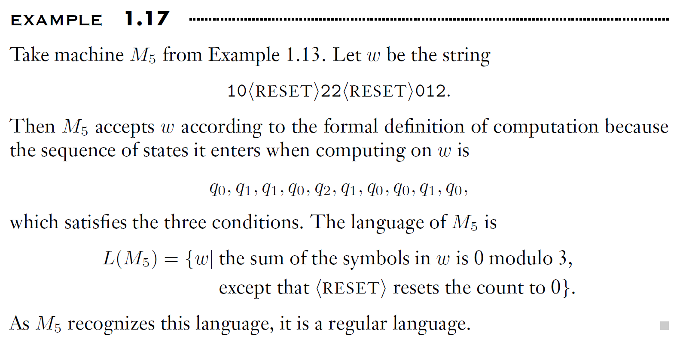

# Regular Languages 正则语言

现实中的计算机太复杂，我们从更加简单和抽象的模型开始学习。我们用计算模型（computational model）来抽象一个计算机，只保留我们关心的核心特征。

我们关注状态和状态之间的转换，而不考虑复杂的内存和硬件，因此这种模型叫做**有限状态机（finite state machine, FSM）**，也叫做有穷自动机（finite automaton）。

这里注意，有限自动机只有有限多个状态，没有额外的存储器，因此并非我们今天正在使用的计算机。现在我们用的计算机，更近似于图灵机（严格意义上的图灵机有无限的存储空间，但如今的计算机在存储空间上已经有极大的扩展空间，因此可以认为近似于图灵机），而非有限状态机。

当然，我们的生活中其实有很多有限状态机，比如：红绿灯、自动售货机、遥控器等。

## 1.1 Finite Automata

### 1.1.1 State Diagram

先来看一个例子：商场宾馆的自动门。

{style="display:block; margin:auto; width:400px;"}

{style="display:block; margin:auto; width:400px;"}

在这个例子中，自动门只有两个状态：CLOSED and OPEN，在这两个状态之间，可能会发生如下状态转移（Transitions）：

* 在CLOSED状态下：
  * 如果前面有人出现（FRONT），那么就打开门
  * 如果后面有人、两侧都有人、两侧都没人，就先保持关着；书中例子的自动门不是我们常见的那种自动门，而是会画一个扇形那样的自动门，所以只能从前门进，开门的时候会扫向侧壁那种感觉，因此这里的保持CLOSED是为了防止撞到人
* 在OPEN状态下：
  * 如果前面有人、后面有人、两侧都有人，则保持开门状态
  * 如果都没人，则转换到CLOSED状态

我们也可以整理为状态表格。

{style="display:block; margin:auto; width:400px;"}

上图是一个非常标准的有穷自动机M1。该图被称为状态图（state diagram），它的三个状态记作q1, q2, q3：

* q1代表 start state 起始状态
* q2代表 accept state 接受状态

上图输入信号为1101. 对于FA，每一个输入符号都只会在被读取的那一刻起作用，当这个符号被用完后，他就被消耗了。但是，信号会改变状态，因此机器可以记住状态。上述过程详细描述如下：

1. 首先第一个1被q1读取后，状态从q1转移到了q2.
2. 然后第二个1被q2读取后，保留在了q2.
3. 然后第三个0被q2读取后，转移到了q3.
4. 然后第四个1被q3读取后，转移到了q2.

输入信号/输入串1101被消耗后，机器停在了q2. 这里要注意，图片中q3到q2的肩头上写了0和1，这里记录的是规则。也就是说，state diagram 状态图中只记录规则，具体的转移需要用户自己去track。

---

### 1.1.2 5-Tuple

一个有限自动机FA可以定义为一个五元组

A finite automaton is a 5-tuple,

$$
(Q, \Sigma, \delta, q_{0}, F)
$$

where

1. $Q$ is a finite set called the **states 状态集合**
2. $\Sigma$ is a finite set called the **alphabet** 字母表
3. $\delta : Q \times \Sigma \to Q$ is the **transition function** 转移函数
4. $q_{0} \in Q$ is the **start state** 起始状态
5. $F \subseteq Q$ is the **set of accept states 接受状态集**

其中，FA必须有start state，但是特殊情况中accept states可以为空。

刚才我们讨论的就可以改写为上述形式。

如果A是机器M可以接受的一串string，那么我们就说：A is the language of machine M, 并写作：

$$
L(M) = A
$$

We say that ***M recognizes A***, or ***M accepts A***.

一台FA机器可以接受若干字符串，但它永远只能识别一个语言。

---

### 1.1.3 Concise Description

书中P37描述了如何标准地去描述一个FA机器。在描述的时候，有连弩各种方法：

* state diagram 状态图，即圆圈和箭头所表达的图
* formal description 形式化描述，即用文字、五元组、转移表的表达

这两种方法是等价的。

书中最后总结了一个集合形式的**concise description**:

$$
L(M_2) = \{ w \mid w \text{ ends in a } 1 \}
$$

上式也可以用语言表达：

> M2 accepts exactly the set of binary strings that end with a 1.

或者用正则表达式：

$$
L(M_2) = (0 + 1) * 1
$$

上面三种方式都是concise description，具体写哪种需要根据需要来进行。concise description就是把哪些串能到达接受态总结成一个简洁的语言描述。

---

再看几个例子：

例1.9

这个例子中accept state接受空和所有以0结尾的string

---

例1.11

start state一旦接收到string，要么去q1，要么去r1，没有返回的情况，所以M4记住了第一个符号。

在左分支，如果最后一个符号是a，M4接受；在右分支，如果最后一个符号是b，M4接受。因此总结来说：

$$
L(M_4) = \{ w \mid w \text{ starts and ends with the same symbol} \}
$$

---

例1.13

首先来看一下题目中给出的alphabet={`<RESET>,0,1,2`}，也就是说输入string可能由四种符号组成，分别是数字0、1、2和特殊符号RESET。

这个FA从q0开始，如果是0就接受，1的话到q1，2的话到q2；在q1这里如果是2就返回q0然后被接受；在q2的话如果是1就回到q0……仔细观察，会发现这就是一个模运算FA。RESET的作用是暂停当前的模运算，进行新的模运算。

对于这个FA，文字描述会更简单和清晰一点。

---

例1.15

这个是上一个题的泛化版本。如果我们画一个Module4，Module5或者Module任意数字的例子，都可以用同样的方法就可以画出来。

### 1.1.4 Formal Definition of Computation

计算的形式化定义。在上面的内容中，我们分别用状态图对FA进行了非形式化的描述，同时也用5元组作为形式化定义描述了它。

我们需要掌握FA形式化的定义方法：

Let $M = (Q, \Sigma, \delta, q_0, F)$ be a finite automaton and let
$w = w_1 w_2 \cdots w_n$ be a string where each $w_i$ is a member of the alphabet $\Sigma$.

Then $M$ **accepts** $w$ if a sequence of states $r_0, r_1, \ldots, r_n$ in $Q$ exists with three conditions:

1. $r_0 = q_0$,
2. $\delta(r_i, w_{i+1}) = r_{i+1}, \quad \text{for } i = 0, \ldots, n-1$,
3. $r_n \in F$.

Condition 1 says that the machine starts in the start state.
Condition 2 says that the machine goes from state to state according to the transition function.
Condition 3 says that the machine accepts its input if it ends up in an accept state.

We say that $M$ **recognizes language** $A$ if

$$
A = \{ w \mid M \text{ accepts } w \}.
$$

A language is called a regular language if some finite automaton recognizes it.

---

上述数理层面的定义也不用太细扣。对于这部分的内容，能够掌握基本概念和基本使用方法就行了：

* 区分DFA和NFA：对于每个状态，如果来一个字符有一个对应的唯一的转移，则是DFA；否则是NFA。作业中基本都是DFA。
* 走完字符串后正好停在接受状态，或者起始点就是接收状态，则称为“接受”。
* 能够看懂并用一句话描述一个DFA。
* 能够根据要求构造DFA。
* 能够对进行简短的证明。

---

例：

### 1.1.5 设计DFA

DFA的D的意思就是确定性（Deterministic），因此对于每一个来自字母表的输入符号，都有且仅有一个确定的下一个状态。所以在课程中，大部分字母表都比较简单。

实践中有时候会用简写（Shorthand），来简化DFA图。

---

例1：设计一个能够识别字符串中1的个数是奇数个还是偶数个的FDA

{style="display:block; margin:auto; width:400px;"}

然后我们加入start state和accept state

{style="display:block; margin:auto; width:400px;"}

这里这么设置的原因是在一个数字都没有读的时候，读到的1的个数是0个，所以start state是q_even。

而accept state的设置并不是固定的。如果你想接受的性质是奇数个，那么就把q_odd设置为accept；否则就把q_even设置为accept。

---

例2：设计一个DFA，识别“至少包含一次字串001的二进制string”

解题思路:

1. 忽略所有的1
2. 一旦看到0，就记住可能是001的第一个0
3. 接着如果还是0，就记住可能是001的00
4. 接下来如果又是一个0，则仍然保持00状态
5. 在00状态下看到1，则找到了解，accept

### 1.1.6 Regular Operations 正则运算

在算术中，数字是对象，加减乘除是工具；在计算理论中，工具是语言，工具则是专门处理语言的运算。

这里的语言指的就是我们刚才学习的形式语言（formal language）。比如在刚才练习的习题“查找string中1的个数是偶数个还是奇数个”这个问题中，如果我们把结果进行正则形式化表述：

**奇数个 1 的语言：**

$$
L_{\text{odd}} = \{\, w \in \{0,1\}^* \mid \#1(w) \equiv 1 \pmod{2} \,\}
$$

**等价正则式：**

$$
0^* 1 0^* (10^*10^*)^*
$$

假设A和B是两个语言，正则运算包括：

- **Union: （并）**

  $$
  A \cup B = \{ x \mid x \in A \;\text{or}\; x \in B \}
  $$
- **Concatenation: （连接）**

  $$
  A \circ B = \{ xy \mid x \in A \;\text{and}\; y \in B \}
  $$
- **Star: （星号）**

  $$
  A^* = \{ x_1 x_2 \cdots x_k \mid k \geq 0 \;\text{and each } x_i \in A \}
  $$

并就是把A和B中所有的string合并在一个语言中。

连接以所有可能的方式，把A中的一个字符串连接在B中的一个字符串的前面，得到新的语言中的全部字符串。

星号运算作用于一个语言，因此是unary operation（一元运算）而不是binary operation（二元运算）。星号运算会把A中的任意个字符串连接在一起，得到新语言中的一个字符串。

---

例：

注意sigma（alphabet）只是保证A和B是合法的，正则运算中不需要用到alphabet中的内容。

## 1.2 Nondeterminism 非确定性

### 1.2.1 DFA, NFA

确定性计算（Deterministic Computation）就是当机器处于给定状态下并读取下一个输入符号时，可以明确知道机器的下一个状态。

在非确定性（Nondeterministic）机器中，则可能存在多个选择，从而导致非唯一的结果。我们在课程中主要讨论DFA，即确定性有穷自动机。NFA则是非确定性有穷自动机。

在上图的例子中，q1状态下如果接受1，可能转移到q2，也可能保持在q1，因此这是非确定性的。

由于课程主要讨论DFA，因此NFA的诸多相关内容这里就不展开讨论了。唯一要明确的是：所有的NFA都能转换为DFA。

以上图为例，我们可以添加一个{q1,q2}的state，从而让q1接受1后指向这个新的state。换句话说，用状态集合的方式可以把同一输入指向不同的状态的不确定性，转化为确定性。

> 定理1.19：每一台NFA都等价于某一台DFA。

> Corollary 1.40: A language is regular if and only if some nondeterministic finite automaton recognizes it.
>
> 推论1.20：一个语言是正则的，当且仅当有一台非确定性有穷自动机识别他。

---

### 1.2.2 Closure under the regular operations

正则语言的封闭性

---

Theorem 1.45: The class of regular languages is closed under the union operation.

定理1.22 正则语言类在并运算下封闭

*详见书上内容*

---

Theorem 1.47: The class of regular languages is closed under the concatenation operation.

定理1.23 正则语言类在连接运算下封闭

*详见书上内容*

---

Theorem 1.49: The class of regular languages is closed under the star operation.

定理1.24 正则语言在星号运算下封闭

*详见书上内容*

## 1.3 Regular Expressions 正则表达式

### 1.3.1 Formal definition of a regular expression

一个正则表达式描述了一个“模式”（Pattern），这个模式定义了一组字符串的规则。匹配引擎在工作时，会从左到右读取这个模式，并尝试从左到右匹配目标字符串。

比如说：

$$
(0 \cup 1)0^*
$$

这个包括两个部分，前半部分的$(0 \cup 1)$代表0或者1；后面的0*代表以0开头的、长度任意的字符串。合起来的意思就是：以0或者1开头的一个，后面全部都是0的任意长度的字符串。

又比如说：

$$
(0 \cup 1)^*
$$

这个代表的就是一个任意长度的binary串。

**在正则表达式中，先做星号运算，然后做连接运算，最后做并运算。**为了更清晰，推荐用括号改变这种惯常顺序。

值得注意的是，如果alphabet只包含0和1，那么就可以用 Σ 作为正则表达式 (0∪1) 的缩写。

总结：

### 1.3.2 Kleene's Theorem

就描述能力而言，正则表达式和DFA是等价的。换句话说，所有的DFA都可以用正则表达式来描述。

**任何一个DFA（确定性有限自动机）所能识别的语言，都一定可以用一个正则表达式来描述。反之，任何一个正则表达式所描述的语言，也一定可以用一个DFA来识别。**

这不仅仅是一个巧合，而是由一条著名的定理——**克林定理 (Kleene's Theorem)** 所保证的。

这个定理揭示了一个深刻的等价关系：

**正则表达式 (Regular Expressions) ⇔ 有限自动机 (Finite Automata)**

具体来说，下面这三种描述语言的方式，它们在表达能力上是**完全等价**的：

1. **正则表达式 (Regular Expression)**
2. **非确定性有限自动机 (NFA)**
3. **确定性有限自动机 (DFA)**

它们都能且仅能描述同一类语言，这类语言被称为  **“正则语言” (Regular Languages)** 。

这种等价关系意味着我们有明确的算法可以在这几种形式之间进行转换：

* **正则表达式 → NFA** ： 我们可以用一种叫做“汤普森构造法” (Thompson's construction) 的算法，将任意一个正则表达式转换成一个等价的NFA。
* **NFA → DFA** ： 我们可以用“子集构造法” (Subset construction) 将任意一个NFA转换成一个等价的DFA。
* **DFA → 正则表达式** ： 同样，我们也有算法（例如“状态消除法” State Elimination Method 或 Brzozowski's Algebraic Method）可以将任意一个DFA转换成一个等价的正则表达式。

## 1.4 Nonregular Languages

### 1.4.1 Pigeonhole Principle

非正则语言就是DFA无法识别的语言，本章主要就是来说明如何识别非正则语言。

对于一个DFA，其本质就是一个状态机，它的状态数量也是有限的。你可以把状态想象成是这台机器的内存，如果一个DFA有10个状态，那么它的内存就只有10个单位。那么，如果我们要做一个无限计数的任务，这个优先内存的特性就会决定该DFA的能力上限。

比如说，语言B={$0^n1^n$ | n>=0}，这个的语言的含义是0和1的数量相等，且0在前1在后。要识别这个语言，机器必须精确地记住它到底读了多少个0，这样才能判断后面的1的数量是否完全相等。假设n可以是任何非负整数，那么这台机器显然需要无限的记忆能力来存储任意大的数字n。然而DFA的内存（状态）是有限的，所以直觉来看，DFA办不到这件事。

本章节主要就是解决这个问题。在解决这个问题之前，介绍一个非常直观的原理——**鸽巢原理（Pigeonhole Principle）**：假设有10个鸽子，9个鸽笼，那么显然有一个鸽笼要放2只鸽子。换句话说，如果你有N个容器，却有N+1个物品，那么至少有一个容器需要装两个或者更多的物品。

对于任意一个DFA，显然鸽笼就是状态集合。这是一个有限的数量，我们称之为p个状态。

而当我们处理一个很长的字符串s的时候，DFA每读取一个字符，就会进入一个状态。如果字符串的长度是n（假设n>=p），那么DFA就会依次经过n+1个状态（包括起始状态）。

现在，我们有n+1长度的状态序列，且有p个DFA本身的状态。根据鸽巢原理，在DFA走过的这个状态序列中，必然至少有一个状态被访问了两次或以上。这个被重复访问的状态就制造了一个“圈”（loop），而这个圈则和下一个我们要探讨的泵引理密切相关。

### 1.4.2 Pumping Lemma

如果 `A` 是一个正则语言，那么它**必然**拥有一个被称为**泵长度 (pumping length)** 的特殊数字 `p`。这个 `p` 具有以下神奇的性质：

对于语言 `A` 中，**任何一个**长度大于或等于 `p` 的字符串 `s`，我们**总能够**找到一种方法，将 `s` 分解成 `x`、`y`、`z` 三段（即 `s = xyz`），并且这个分解方式必须满足以下三个条件：

1. **`xy^iz ∈ A`，对于所有 `i ≥ 0`**
   * 这是“泵”的核心。意思是，你可以把中间的 `y` 段复制任意次数（`i`=2, 3, 4...）、保持原样（`i`=1），或者完全删除（`i`=0），得到的新字符串（如 `xyyz`, `xyz`, `xz`）**必须**仍然是语言 `A` 的一部分。
2. **`|y| > 0`**
   * 这个条件保证了我们用来“泵”的 `y` 段 **不是空的** 。如果 `y` 可以是空的，那么第一条规则就变得毫无意义了，因为复制或删除一个空字符串不会改变任何东西。
3. **`|xy| ≤ p`**
   * 这个条件规定，我们找到的这个可“泵”的 `y` 段，必须出现在字符串的 **早期部分** 。从字符串开头到 `y` 段结束的这部分（即 `xy`）的总长度，不能超过我们一开始说的那个特殊数字 `p`（泵长度）。

**书本上的补充说明：**

* `x` 和 `z` 可以是空字符串，但 `y` 不行。
* 条件2和条件3是技术性约束，它们在后续用这个引理去证明一个语言**不是**正则的时候，会起到至关呈要的作用。

---

**泵引理证明的详细步骤**

**目标：** 证明如果 `A` 是一个正则语言，那么它满足泵引理。

**第1步：前提与设定 (Premise and Setup)**

1. **假设 `A` 是正则语言** : 根据正则语言的定义，我们知道必然存在一个确定性有限自动机 (DFA) `M` 来识别它。
2. **形式化 `M`** : 我们将 `M` 定义为 `(Q, Σ, δ, q₀, F)`，其中 `Q` 是 `M` 的状态集合。
3. **设定泵长度 `p`** : 我们将泵引理中提到的泵长度 `p`，直接设定为DFA `M` 的 **状态总数** 。即 `p = |Q|`。这是整个证明最关键的一步设定。

**第2步：选择字符串并观察其状态序列**

1. **选择字符串 `s`** : 从语言 `A` 中选择**任意一个**长度 `n` 大于或等于 `p` 的字符串，即 `|s| = n ≥ p`。（如果语言 `A` 中不存在这样的长字符串，那么泵引理的条件自然成立，因为它的要求是针对所有长字符串的，没有长字符串就等于没有反例。）
2. **生成状态序列** : 让DFA `M` 读取字符串 `s = s₁s₂...sₙ`。我们会得到一个状态序列 `r₀, r₁, r₂, ..., rₙ`，其中 `r₀ = q₀` 是起始状态，`rᵢ` 是读取了前 `i` 个字符后 `M` 所处的状态。
3. **计算序列长度** : 这个状态序列总共包含了 `n+1` 个状态。

**第3步：应用鸽巢原理找到重复状态 (核心论证)**

1. **确定“鸽子”和“鸽笼”** :

* **鸽笼 (Containers)** : DFA `M` 自身的所有状态，共 `p` 个。
* **鸽子 (Items)** : 上述状态序列中的 **前 `p+1` 个状态** ，即 `r₀, r₁, ..., rₚ`。

1. **得出结论** : 因为 `p+1 > p`，“鸽子”数量多于“鸽笼”数量。根据 **鸽巢原理** ，在这 `p+1` 个状态中， **必然至少有一个状态是重复出现的** 。
2. **形式化重复状态** : 这意味着，我们一定能找到两个不同的下标 `j` 和 `l`，满足 `0 ≤ j < l ≤ p`，使得状态 `rⱼ` 和状态 `rₗ` 是同一个状态，即 `rⱼ = rₗ`。

**第4步：根据重复状态分解字符串 `s`**

我们利用找到的重复状态 `rⱼ = rₗ` 来将字符串 `s` 分解成 `xyz` 三段：

* **`x`** : 是 `s` 的前 `j` 个字符 (`s₁...sⱼ`)。这部分字符串将 `M` 从起始状态 `r₀` 带到了 `rⱼ`。
* **`y`** : 是 `s` 的第 `j+1` 到第 `l` 个字符 (`sⱼ₊₁...sₗ`)。这部分字符串将 `M` 从 `rⱼ` 带到 `rₗ`，因为 `rⱼ = rₗ`，所以 `y` 驱动 `M` 走了一个 **状态回路** 。
* **`z`** : 是 `s` 剩下的部分 (`sₗ₊₁...sₙ`)。这部分字符串将 `M` 从 `rₗ` 带到了最终状态 `rₙ`。

**第5步：验证分解后的 `xyz` 满足泵引理的三个条件**

现在，我们来逐一验证这样分解出的 `xyz` 满足泵引理的所有要求。

1. **验证 `|y| > 0`** :

* 因为我们找到的下标 `j` 和 `l` 满足 `j < l`，这意味着从 `j+1` 到 `l` 至少有一个数字。所以，子字符串 `y` 至少包含一个字符 `sⱼ₊₁`。因此，`y` 不可能是空字符串。**(条件满足)**

1. **验证 `|xy| ≤ p`** :

* 字符串 `xy` 的长度就是 `l`。根据我们在第3步的推导，重复状态 `rₗ` 是在状态序列的前 `p+1` 个成员中找到的，所以 `l` 的最大值就是 `p`。因此，`|xy| = l ≤ p`。**(条件满足)**

1. **验证 `xy^iz ∈ A` 对所有 `i ≥ 0` 成立** :

* 我们来分析 `M` 如何处理 `xy^iz`：
  * `M` 读取 `x` 后，从 `r₀` 到达 `rⱼ`。
  * `M` 读取 `y` 后，从 `rⱼ` 绕一圈回到 `rⱼ`。无论读取多少次（`i` 次）`y`，`M` 最终都会停在 `rⱼ` 状态。
  * 如果 `i=0`，相当于不读取 `y`，`M` 停在 `rⱼ`。
  * 最后，`M` 从 `rⱼ` 开始读取 `z`。因为 `rⱼ = rₗ`，所以从 `rⱼ` 开始读 `z` 和从 `rₗ` 开始读 `z` 的效果完全相同，都会最终到达 `rₙ` 状态。
* 由于原始字符串 `s=xyz` 在语言 `A` 中，所以 `rₙ` 必须是一个接受状态。因此，无论 `i` 是多少，`M` 处理 `xy^iz` 后都会到达同一个接受状态 `rₙ`。这意味着所有 `xy^iz` 形式的字符串都被 `M` 接受，即它们都在语言 `A` 中。**(条件满足)**

**结论**

我们已经证明，从“`A`是正则语言”这个唯一的前提出发，可以推导出：对于 `A` 中任意一个足够长的字符串 `s`，我们总能找到一种满足泵引理所有三个条件的 `xyz` 分解方式。这表明泵引理的陈述是完全正确的。

---

现在我们来看一下上一节提到的语言 `L = {0ⁿ1ⁿ | n ≥ 0}`。它包含 "ε", "01", "0011", "000111" 等。我们可以用pumping lemma证明该语言不是正则语言。

**证明回顾：**

1. **假设**它是正则的，拥有泵长度 `p`。
2. 我们选择字符串 `s = 0^p1^p`。
3. 因为 `|xy| ≤ p`，所以 `y` 必然只包含 `0`。
4. 当我们“泵” `y` 时（比如复制一次得到 `xyyz`），我们增加了 `0` 的数量，但 `1` 的数量不变。
5. 新字符串 `xyyz` 的 `0` 和 `1` 数量不再相等，所以它**不属于**语言 `L`。
6. 这与泵引理的承诺（泵完之后还必须在语言里）产生 **矛盾** 。
7. **因此，语言 L 不是正则的，所以不存在任何DFA可以识别它。**

## 附：练习

注：pumping theory这个课程中会有作业、考试等，需要特别注意一点。之后补充。
